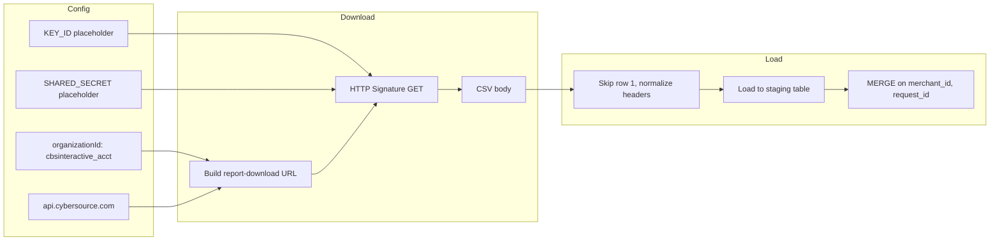

# CyberSource Daily Report Download and BigQuery Load

## Summary

Implement a Python script that:

1. Calls the CyberSource Reporting API to **download** the daily report by name and date.
2. Treats **row 1 as junk** and **row 2 as the CSV header**; **normalize headers**: replace spaces with underscores and convert to lowercase.
3. **Upserts** the data into BigQuery table `**i-dss-streaming-data.payment_ops_sandbox.d2c_cybs_dmdr`** using `**merchant_id`** and `**request_id`** as the match keys.
4. Uses **placeholders** for the API key (key ID) and shared secret; production host and org are fixed as specified.

---

## API Details (from docs)

**Retrieving (optional):**  
`GET https://api.cybersource.com/reporting/v3/reports?startTime={ISO8601}&endTime={ISO8601}&timeQueryType=reportTimeFrame`  
Returns a list of reports; you can filter by `reportName`, `reportStatus=COMPLETED`, etc., to get a `reportId`.

**Download (required):**  
`GET https://api.cybersource.com/reporting/v3/report-downloads?organizationId=cbsinteractive_acct&reportDate={YYYYMMDD}&reportName=daily_dmdr_dom`  

- **Host:** `api.cybersource.com` (production).  
- **Report date:** Use `YYYYMMDD` (e.g. `20180220`) as in the official example.  
- **Accept header:** `text/csv` so the response is CSV.  
- **Authentication:** HTTP Signature (CyberSource REST standard). The client must send signed headers (e.g. `v-c-merchant-id`, `Date`, `Host`, `Signature`, and for GET often an empty or fixed `Digest`). Credentials are: **Key ID** (serial number), **Shared Secret**, and **Merchant/Org ID** (here `cbsinteractive_acct`).

Docs: [Reporting Retrieving](https://developer.cybersource.com/docs/cybs/en-us/reporting/developer/all/rest/reporting/reporting_api/reporting-retrieving.html), [Reporting Download](https://developer.cybersource.com/docs/cybs/en-us/reporting/reporting_api/reporting-download.html), [Creating Requests](https://developer.cybersource.com/docs/cybs/en-us/reporting/developer/all/rest/reporting/reporting_api/reporting-client-apps-create-request.html).

---

## Implementation Plan

### 1. Script location and structure

- Add a single script, e.g. `**scripts/download_cybersource_daily_report.py`** (or under a `cybersource/` folder if you prefer).  
- Use **placeholders** for credentials: e.g. read from env `CYBERSOURCE_KEY_ID` and `CYBERSOURCE_SHARED_SECRET`, with constants like `CYBERSOURCE_KEY_ID = os.environ.get("CYBERSOURCE_KEY_ID", "YOUR_KEY_ID")` and same for shared secret so the script runs only after the user sets real values.  
- Fixed config: `organization_id = "cbsinteractive_acct"`, `base_url = "https://api.cybersource.com"`, `report_name = "daily_dmdr_dom"`.

### 2. Authentication (HTTP Signature)

- CyberSource REST (including Reporting) uses **HTTP Signature** (not Basic Auth): key ID, shared secret, and merchant ID in headers with a signature over a string built from `host`, `date`, `request-target`, and optionally `digest`.  
- **Option A (recommended):** Use `**cybersource-rest-client-python`** if it exposes a way to run a signed GET (some SDKs expose a low-level signed request). Then use that to perform the GET to the report-download URL.  
- **Option B:** Implement the signature manually: build the signing string per [CyberSource HTTP Signature](https://developer.cybersource.com/library/documentation/dev_guides/REST_API/Getting_Started/html/REST_GS/ch_authentication.5.3.htm), compute HMAC-SHA256 with the shared secret, set headers `v-c-merchant-id`, `Date`, `Host`, `Signature`, and for GET either no body and no Digest or Digest for an empty body as required by the docs.  
- In the script, **leave placeholders** for key and shared secret (env vars or constants); do not hardcode real credentials.

### 3. Download report

- Build URL:  
`{base_url}/reporting/v3/report-downloads?organizationId=cbsinteractive_acct&reportDate={report_date}&reportName=daily_dmdr_dom`  
with `report_date` in `YYYYMMDD` (e.g. yesterday or a passed-in date).  
- Send **GET** with header `Accept: text/csv`.  
- Handle 200 (save body as CSV), 404/400 with clear errors (report not found / invalid request).

### 4. Row 1 removed / row 2 as header / header normalization

- **Process in Python** (required for header normalization): Read the CSV (e.g. with `pandas` or `csv`), **skip row 1**, use row 2 as the header. **Normalize header names**: replace spaces with underscores and convert to lowercase (e.g. `"Merchant ID"` → `merchant_id`). Write the normalized CSV to a buffer or temp file for load, or keep in a DataFrame.
- This ensures BigQuery column names are valid and consistent (`merchant_id`, `request_id`, etc.).

### 5. Load into BigQuery and upsert

- **Target table (fixed):** `i-dss-streaming-data.payment_ops_sandbox.d2c_cybs_dmdr`.
- **Upsert strategy:** Load the normalized data into a **staging table** (e.g. same dataset, table name like `d2c_cybs_dmdr_staging` or a temp table), then run a **MERGE** (or use a query that deletes + inserts by partition if preferred).  
  - **MERGE** key columns: `**merchant_id`** and `**request_id`**.  
  - Logic: for each row in staging, if a row in the target exists with the same `(merchant_id, request_id)`, update it; otherwise insert. Use standard BigQuery MERGE syntax: `MERGE ... USING staging_table AS s ON target.merchant_id = s.merchant_id AND target.request_id = s.request_id WHEN MATCHED THEN UPDATE SET ... WHEN NOT MATCHED THEN INSERT ...`.
- Use `**google-cloud-bigquery`** (already in [requirements.txt](requirements.txt)): load staging via `load_table_from_file()` or `load_table_from_dataframe()` with the normalized CSV/DataFrame; then execute a MERGE SQL statement (e.g. `client.query(merge_sql)`).
- Use **Application Default Credentials** for BigQuery (same as [scripts/run_dow_hourly_slack.py](scripts/run_dow_hourly_slack.py)).

### 6. CLI and scheduling

- **Arguments:** At least `--report-date` (YYYYMMDD); optional flags for dry-run (download only, no load) or load-only (if file already on disk). BigQuery table is fixed; no need for dataset/table args.  
- **Date default:** Default `report_date` to **yesterday** (UTC or local) so a cron job run at 8am fetches the previous day’s report without args.  
- Document in the script docstring how to set `CYBERSOURCE_KEY_ID` and `CYBERSOURCE_SHARED_SECRET` and include a **cron example** (daily 8am) with the repo path placeholder.

### 7. Dependencies

- Keep `**google-cloud-bigquery`** and `**pandas`** (if you use DataFrame path).  
- Add `**requests`** for the GET to CyberSource if not already present.  
- Optionally add `**cybersource-rest-client-python`** if you use the SDK for HTTP Signature; otherwise implement signing with stdlib `hmac` + `hashlib`.

### 8. Error handling and idempotency

- If the report is missing (404) or not ready, exit with a non-zero code and a clear message; optionally retry logic for 404 (e.g. report not yet generated).  
- **Upsert** makes repeated runs idempotent: same `(merchant_id, request_id)` in the file will update the existing row in `d2c_cybs_dmdr`; new keys will be inserted. Staging table can be overwritten each run (`WRITE_TRUNCATE`) before the MERGE.

### 9. Local cron schedule (daily at 8:00 AM)

- **Schedule:** Run the script **every day at 8:00 AM** local time using cron.
- **Crontab entry:**  
`0 8 * * * cd /path/to/pplus-web-payments-cursor-explore && .venv/bin/python scripts/download_cybersource_daily_report.py >> /tmp/cybersource_dmdr_cron.log 2>&1`  
Replace `/path/to/pplus-web-payments-cursor-explore` with the actual repo path (or use `$HOME/...`). Use the project’s `.venv` so dependencies (e.g. `google-cloud-bigquery`, `requests`) are available.
- **Environment:** Cron runs with a minimal environment. The script needs:
  - **CyberSource:** `CYBERSOURCE_KEY_ID` and `CYBERSOURCE_SHARED_SECRET` (set in crontab or loaded from a file). Example in crontab:  
  `CYBERSOURCE_KEY_ID=your_key_id` and `CYBERSOURCE_SHARED_SECRET=your_secret` on lines before the job, or run a wrapper that sources `.env` from the repo.
  - **BigQuery:** Application Default Credentials (ADC). Ensure ADC is set up for the user that runs cron (e.g. run `scripts/setup-adc.sh` or `gcloud auth application-default login` once). No env vars required for BigQuery if ADC is configured.
- **Report date:** The script should default `--report-date` to **yesterday** (e.g. UTC or local date minus one day) so that when cron runs at 8am, it fetches the previous day’s report. Document this in the script.
- **Optional:** Add a one-line cron example to the script docstring or a small `docs/cron-cybersource-dmdr.md` / comment in the plan so the user can copy-paste the crontab line after replacing the path.

---

## Flow (high level)

---

## Files to add/change

| Action            | File                                                                                                                                                                                                                                                            |
| ----------------- | --------------------------------------------------------------------------------------------------------------------------------------------------------------------------------------------------------------------------------------------------------------- |
| Add               | `scripts/download_cybersource_daily_report.py` – main script (placeholders for key/secret, HTTP Signature GET, skip row 1, header normalize, load to staging, MERGE into `i-dss-streaming-data.payment_ops_sandbox.d2c_cybs_dmdr` on merchant_id + request_id). |
| Optionally update | `requirements.txt` – add `requests` (and optionally `cybersource-rest-client-python` if using SDK).                                                                                                                                                             |
| Document          | Script docstring: cron example for **daily 8:00 AM** run (`0 8 * * *`), repo path, and env vars (`CYBERSOURCE_KEY_ID`, `CYBERSOURCE_SHARED_SECRET`, ADC for BigQuery).                                                                                          |

---

## Placeholders to include in script

- `CYBERSOURCE_KEY_ID` – env var or constant, e.g. `os.environ.get("CYBERSOURCE_KEY_ID", "YOUR_KEY_ID")`.
- `CYBERSOURCE_SHARED_SECRET` – env var or constant, e.g. `os.environ.get("CYBERSOURCE_SHARED_SECRET", "YOUR_SHARED_SECRET")`.
- Organization ID and host are fixed: `cbsinteractive_acct`, `https://api.cybersource.com`.
- Report name fixed: `daily_dmdr_dom`.
- **BigQuery target table (fixed):** `i-dss-streaming-data.payment_ops_sandbox.d2c_cybs_dmdr`; upsert key columns: `**merchant_id`**, `**request_id**`.

No other deliverables (e.g. unit tests or CI) are in scope unless you request them.