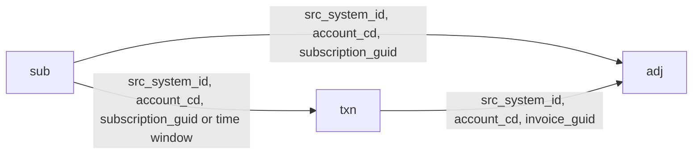

# Gateway Performance Comparison Query – Categorization and Design

## Goal

- **Step 1 (this plan):** Categorize subscriptions, transactions, and invoices using the rules you provided, on top of [queries/txn.sql](queries/txn.sql), [queries/adj.sql](queries/adj.sql), and [queries/sub.sql](queries/sub.sql).
- **Step 2 (follow-on):** Use those categories to compute performance by gateway and card bin: transaction-level and invoice-level success rates, aggregated by gateway and timeframe (day/week/month/quarter), with optional card bin breakdown.

---

## Data model and join summary

- **sub ↔ adj:** `src_system_id`, `account_cd`, `subscription_guid`.
- **sub ↔ txn (with invoice):** `src_system_id`, `account_cd`, and either `subscription_guid` or time window: `txn.trans_dt_ut` between `coalesce(sub.prior_expiration, timestamp('1900-01-01 00:00:01 UTC'))` and `coalesce(sub.activate_dt_ut, timestamp('2999-12-31 23:59:59 UTC'))`.
- **txn ↔ adj:** `src_system_id`, `account_cd`, `invoice_guid` (verifications and non-renewal declined purchases have no `invoice_guid` and need special handling).

Existing helpers to reuse from [queries/sub.sql](queries/sub.sql): `prior_expiration`, `original_activation`, `frn` (first subscription per account), `pre_activate`/`post_activate` (e.g. ±2 min around activation), `pre_trial_end`/`post_trial_end` (±2 min around trial end). From [queries/adj.sql](queries/adj.sql): `earliest_inv` (dense_rank per subscription for invoice order).

---

## Step 1: Subscription categorization

Add to the **sub** CTE (or a wrapper CTE that selects from it):

- **Subscription category** (per row):
  - **initial:**  
    - `subscription_guid` is the one with the earliest `activate_dt_ut` for `(src_system_id, account_cd)` (i.e. `frn = 1`), **or**  
    - the account has no subscription row (handled when joining from txn/invoice with no sub match), **or**  
    - the transaction/invoice date is **before** `account_earliest_activation` (applied when assigning category to txn/inv).
  - **restart:**  
    - `subscription_guid` is not the earliest activation (`frn != 1`), **or**  
    - the transaction/invoice date is **after** `account_earliest_expiration`.

Implement as a single `subscription_category` on the sub row (e.g. `case when frn = 1 then 'initial' else 'restart' end`). The “no sub” and “date before first activation / after first expiration” cases are applied when categorizing transactions and invoices that reference a time window or no subscription.

---

## Step 1: Transaction categorization

Build a **transaction-level** dataset that joins txn to sub and adj as needed, then assigns **transaction_category** in a single CASE evaluated in this order (first match wins):

1. **change_sub**
  `txn.trans_type_desc = 'purchase'` and `txn.trans_status_desc in ('success','void','declined')` and `txn.origin_desc = 'api_sub_change'`.
2. **trial_verify**
  - Successful verification: `txn.trans_type_desc = 'verify'` and `txn.trans_status_desc in ('success','void')` and `txn.trans_dt_ut` within a few minutes of a subscription’s `activate_dt_ut` where `sub.trial_end_dt_ut is not null` (use sub’s pre_activate/post_activate or e.g. ±2 minutes). Join: txn to sub on `(src_system_id, account_cd)` and `txn.trans_dt_ut between sub.prior_expiration and sub.activate_dt_ut` (or between pre_activate and post_activate for “near activation”).  
  - Declined verification: `txn.trans_type_desc = 'verify'` and `txn.trans_status_desc = 'declined'`. Same join by account and time window: `txn.trans_dt_ut between coalesce(sub.prior_expiration, '1900-01-01') and coalesce(sub.activate_dt_ut, '2999-12-31')`.
3. **trial_to_paid**
  Purchase on first >$0 **renewal** invoice, with trial, and invoice billed within 2 minutes of trial end.  
   Join: txn → adj (src_system_id, account_cd, invoice_guid), adj → sub (src_system_id, account_cd, subscription_guid).  
   Conditions: `txn.trans_type_desc = 'purchase'`, `adj.invoice_type_cd = 'renewal'`, `adj.adj_total_amt > 0`, `sub.trial_end_dt_ut is not null`, and `adj.invoice_billed_dt_ut` within 2 minutes of `sub.trial_end_dt_ut`. Restrict to “first” such renewal (e.g. `earliest_inv` for renewal-only rank if available, or first renewal by invoice_billed_dt_ut).
4. **direct_to_paid**
  - **Pre 2025-11-06 (Scenario 1):** Purchase (success/void/declined) linked to an invoice where `adj.subscription_guid = sub.subscription_guid`, `sub.trial_end_dt_ut is null`, `adj.invoice_type_cd = 'renewal'`, and `sub.activate_dt_ut` within 10 minutes of `adj.invoice_billed_dt_ut`.  
  - **From 2025-11-06 (Scenario 2):**  
    - Successful purchase where `txn.subscription_guid = sub.subscription_guid`, `sub.trial_end_dt_ut is null`, `adj.invoice_type_cd = 'purchase'`, and `sub.activate_dt_ut` within 2 minutes of `txn.trans_dt_ut`.  
    - Declined purchase where `txn.trans_dt_ut` between `coalesce(sub.prior_expiration, '1900-01-01')` and `coalesce(sub.activate_dt_ut, '2999-12-31')` (join by account + time window; no invoice).
5. **recurring**
  Purchase (success/void/declined) linked to a **renewal** invoice that is **not** the earliest renewal on that subscription. Join txn → adj → sub. Use a renewal-specific rank (e.g. `renewal_earliest_inv`) so “earliest renewal” = 1; then recurring = `adj.invoice_type_cd = 'renewal'` and `renewal_earliest_inv > 1` (or equivalent).
6. **other_verify**
  `txn.trans_type_desc = 'verify'` and not already classified as trial_verify.
7. **other**
  Everything else.

**Special rows (no invoice):**

- **Verifications:** No `subscription_guid` or `invoice_guid`. Join txn to sub only on `(src_system_id, account_cd)` and `txn.trans_dt_ut between prior_expiration and activate_dt_ut` to assign trial_verify vs other_verify and to support invoice-level “virtual” grouping later (group verify attempts by that same window for invoice-level metrics).
- **Non-renewal declined purchases:** `txn.trans_status_desc = 'declined'`, `txn.trans_type_desc = 'purchase'`, `adj.invoice_type_cd != 'renewal'` (or no invoice), `txn.origin_desc in ('token_api','api')`. Two ways to include them in invoice-level metrics:  
  - **(A)** Assign each decline to the invoice of the next successful purchase in the same (prior_expiration, activate_dt_ut) window (if any); otherwise treat as a “virtual” invoice group by that window.  
  - **(B)** Don’t assign to a real invoice; only group by (account, time window) for invoice-level counts (e.g. one “logical invoice” per window that had only declines).

Recommend implementing **(A)** for “successful invoices / total invoices” so that a window that had declines then success counts as one invoice (the one that got paid); windows with only declines form a separate “invoice” for rate denominator.

---

## Step 1: Invoice categorization

Invoices get **invoice_category** from the type of activity they represent:

- **trial_verify:** Invoices don’t exist for verifications; for “invoice-level” verification metrics, use the derived grouping (e.g. by account + prior_expiration/activate_dt_ut window) and assign that group the category trial_verify.
- **trial_to_paid:** Invoice is the first >$0 renewal on a trial subscription, billed within 2 minutes of trial end (same logic as transaction trial_to_paid).
- **direct_to_paid:** Invoice meets Scenario 1 or 2 (renewal with activation within 10 min pre-2025-11-06, or purchase invoice with activation within 2 min from 2025-11-06).
- **recurring:** Renewal invoice that is not the earliest renewal on the subscription.
- **change_sub:** Invoice has a purchase with `origin_desc = 'api_sub_change'`.
- **other:** Everything else.

Implement by: (1) defining invoice-level attributes (subscription, trial_end_dt_ut, invoice_type_cd, adj_total_amt, invoice_billed_dt_ut, renewal rank, etc.) from adj + sub, and (2) applying the same date and type rules as above. Optionally, derive invoice_category from the transaction_category of the “primary” transaction on that invoice (e.g. the successful one or the first one) to keep one source of truth.

---

## Step 2: Performance comparison (after categorization)

- **Transaction-level:**  
For each (gateway, timeframe, [card_bin]):  
  - **Success rate** = count(success or void) / count(all) where success = `trans_status_desc in ('success','void')`.  
  - Timeframe from `txn.trans_dt` (day, week, month, quarter via `date_trunc` or `extract`).
- **Invoice-level:**  
For each (gateway, timeframe, [card_bin]):  
  - **Success rate** = count(successful invoices) / count(all invoices).  
  - Successful invoice = at least one success/void purchase on that invoice (or, for verification/decline-only windows, define explicitly).  
  - Timeframe from `adj.invoice_billed_dt_ut` (same grains: day, week, month, quarter).  
  - Include verification “invoices” (grouped by time window) and non-renewal decline attempts (grouped by window or assigned to eventual success invoice) in the denominator and, where applicable, numerator.
- **Gateway** = `txn.trans_gateway_type_desc`; **card bin** = `txn.cc_first_6_nbr`.  
- Expose one result set (or two: transaction-level and invoice-level) with columns such as: `trans_gateway_type_desc`, `timeframe_type` (day/week/month/quarter), `timeframe_value` (e.g. date or period start), optional `cc_first_6_nbr`, `transaction_category` and/or `invoice_category`, `total_transactions`, `successful_transactions`, `txn_success_rate`, `total_invoices`, `successful_invoices`, `inv_success_rate`.

---

## Implementation notes

- **SQL style:** Per your rules, in SELECTs use leading commas and `where 1=1` in WHERE clauses.
- **Recurly joins:** Always include `src_system_id` and `account_cd` in joins involving Recurly data.
- **Earliest renewal invoice:** In adj, add

