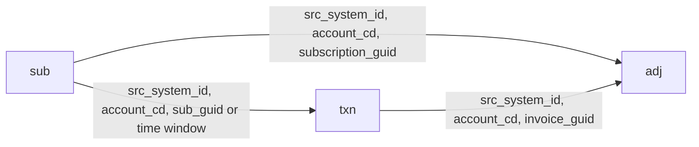

# Gateway Performance Comparison Query (Clean Structure)

## Goal

- **Categorize** subscriptions (`initial` / `restart`), then transactions and invoices (`trial_verify`, `trial_to_paid`, `direct_to_paid`, `recurring`, `change_sub`, `other_verify`, `other`).
- **Base CTE:** One row per transaction with a stable **invoice grouper** (real `invoice_guid` or derived key for verifications and non-renewal declines).
- **Aggregate** by gateway (`txn.trans_gateway_type_desc`) and timeframe (day, week, month, quarter) from `txn.trans_dt` (transaction-level) and `adj.invoice_billed_dt_ut` (invoice-level), with optional breakdown by **top 100 card bins by volume per timeframe** (`txn.cc_first_6_nbr`).
- **Metrics:** Transaction success rate = successful txns / total txns; invoice success rate = successful invoices / total invoices.

---

## Data model and joins

- **sub ↔ adj:** `src_system_id`, `account_cd`, `subscription_guid`.
- **sub ↔ txn:** `src_system_id`, `account_cd`, and either `subscription_guid` or time window: `txn.trans_dt_ut` between `coalesce(sub.prior_expiration, '1900-01-01')` and `coalesce(sub.activate_dt_ut, '2999-12-31')`.
- **txn ↔ adj:** `src_system_id`, `account_cd`, `invoice_guid`. Verifications and non-renewal API declines have no `invoice_guid` and need derived grouping.

**Sources:** Base logic from [queries/txn.sql](queries/txn.sql), [queries/adj.sql](queries/adj.sql), [queries/sub.sql](queries/sub.sql). Patterns and category alignment from [queries/gateway_performance_by_bin.sql](queries/gateway_performance_by_bin.sql) and [queries/gateway_performance_example1.sql](queries/gateway_performance_example1.sql), simplified.

---

## Query structure (CTE flow)

1. **sub** – From [queries/sub.sql](queries/sub.sql): same columns and window fields (`prior_expiration`, `post_activate`, `pre_trial_end`, `post_trial_end`, `frn`, `original_activation`, etc.). Add `account_earliest_activation` and `account_earliest_expiration` (max/min per account) for subscription categorization.
2. **sub_categorized** – Add `subscription_category`: `initial` when `frn = 1` (or no sub / date before earliest activation when used at txn/inv level); `restart` otherwise (or date after earliest expiration).
3. **adj** – From [queries/adj.sql](queries/adj.sql): same structure plus `paid_by_gc_chk`, `earliest_inv`. Add **renewal rank** per subscription (e.g. `renewal_earliest_inv` = 1 for first renewal) for recurring vs first renewal.
4. **adj_categorized** – Join adj to sub_categorized; assign **invoice_category** (`trial_to_paid`, `direct_to_paid`, `recurring`, `change_sub`, `other`) using invoice_type_cd, trial_end_dt_ut, invoice_billed_dt_ut vs activate_dt_ut/trial_end_dt_ut, and renewal rank. `change_sub` via existence of a purchase with `origin_desc = 'api_sub_change'` on that invoice.
5. **txn** – From [queries/txn.sql](queries/txn.sql): filter `trans_type_desc in ('purchase','verify')`, `trans_status_desc in ('success','void','declined')`, and same filters as base; include `trans_gateway_type_desc`, `cc_first_6_nbr`, `trans_dt`, `trans_dt_ut`, etc.
6. **txn_adj** – txn left join adj_categorized on `src_system_id`, `account_cd`, `invoice_guid` to get invoice attributes (e.g. `invoice_type_cd`, `invoice_billed_dt_ut`, `renewal_earliest_inv`, `invoice_category`) only for rows that have an invoice.
7. **txn_with_sub_win** – Join each txn to the subscription whose **activation window** contains `trans_dt_ut`: `(src_system_id, account_cd)` and `trans_dt_ut between prior_expiration and post_activate`. Use `QUALIFY row_number() ... order by activate_dt_ut` to keep one sub per txn. This supports verifications and declined purchases without invoice.
8. **txn_with_subs** – Enrich with subscription by **subscription_guid** (txn’s `subscription_guid` = sub’s `subscription_guid`) for trial_end_dt_ut, pre_activate, post_activate, pre_trial_end, post_trial_end used in categorization.
9. **txn_categorized** – Single `CASE` (first match wins) to set **transaction_category**:
  - **change_sub:** `trans_type_desc = 'purchase'` and `origin_desc = 'api_sub_change'`.
  - **trial_verify:** (a) `trans_type_desc = 'verify'` and `trans_status_desc in ('success','void')` and txn within pre_activate/post_activate of a sub with `trial_end_dt_ut is not null` (use sub from window join); (b) `trans_type_desc = 'verify'` and `trans_status_desc = 'declined'` (join to sub by window).
  - **trial_to_paid:** Purchase on first >$0 renewal, with `sub.trial_end_dt_ut is not null` and `invoice_billed_dt_ut` within 2 min of `trial_end_dt_ut` (pre_trial_end/post_trial_end), `renewal_earliest_inv = 1`.
  - **direct_to_paid:**  
    - Pre 2025-11-06 (Scenario 1): Purchase (success/void/declined) linked to invoice where `adj.subscription_guid = sub.subscription_guid`, `sub.trial_end_dt_ut is null`, `adj.invoice_type_cd = 'renewal'`, `sub.activate_dt_ut` within 10 min of `invoice_billed_dt_ut`.  
    - From 2025-11-06 (Scenario 2): (a) Successful purchase where `txn.subscription_guid = sub.subscription_guid`, `sub.trial_end_dt_ut is null`, `adj.invoice_type_cd = 'purchase'`, `sub.activate_dt_ut` within 2 min of `trans_dt_ut`; (b) Declined purchase with `origin_desc in ('token_api','api')` and no invoice (or non-renewal invoice) and `trans_dt_ut` in sub window (from txn_with_sub_win).
  - **recurring:** Purchase (success/void/declined) on renewal invoice with `renewal_earliest_inv > 1`.
  - **other_verify:** `trans_type_desc = 'verify'` and not trial_verify.
  - **other:** Else.
10. **invoice_grouper for rows without invoice** – For verifications and non-renewal declined purchases, define a derived key. Two behaviors:
  - **Verifications:** `invoice_grouper = (src_system_id, account_cd, sub_win.prior_expiration, sub_win.activate_dt_ut)` so all attempts in the same window are one “invoice” for invoice-level metrics.
    - **Non-renewal declined purchases:** Prefer **assign to eventual success invoice**: in the same (prior_expiration, activate_dt_ut) window, if there is a successful purchase later, assign the decline to that invoice’s `invoice_guid`; otherwise use the same window key as grouper. Implementation: CTE that finds, per (src_system_id, account_cd, window), the `invoice_guid` of the first success in that window (if any); then txn_categorized left join that and use `coalesce(invoice_guid, window_grouper)`.
11. **txn_invoice_base** – Final base CTE: all categorized transactions with:
  - `invoice_grouper` = `coalesce(nullif(trim(invoice_guid),''), derived_window_key)` (or derived key from eventual-success assignment for declines).
    - `invoice_dt_ut` = `coalesce(invoice_billed_dt_ut, trans_dt_ut)` for invoice-level timeframe.
    - Optionally restrict to **top 100 bins per timeframe** later (see below).
12. **invoice_success** – Per (src_system_id, account_cd, invoice_grouper): `max(case when purchase/verify success then 1 else 0 end)`.
13. **Transaction-level aggregation** – From txn_invoice_base: group by `trans_gateway_type_desc`, `date(trans_dt)`, `date_trunc(trans_dt, week)`, `date_trunc(trans_dt, month)`, `date_trunc(trans_dt, quarter)`, `cc_first_6_nbr`, `transaction_category`. Sum counts and success counts; compute `txn_success_rate`.
14. **Invoice-level aggregation** – Real invoices: join adj_categorized_final to txn_invoice_base to get gateway/bin per invoice, then to invoice_success; use `invoice_billed_dt_ut` for day/week/month/quarter. Verification “invoices”: from txn_invoice_base where `transaction_category in ('trial_verify','other_verify')` and `invoice_grouper like 'window_%'`, aggregate by gateway, bin, category, and same timeframes using `trans_dt` (or invoice_dt_ut). Union and sum to get total_invoices and successful_invoices per (gateway, timeframe, bin, category).
15. **Top 100 bins per timeframe** – Compute transaction volume per (timeframe_type, timeframe_value, cc_first_6_nbr). Then either:
  - **Option A:** In the final SELECT(s), join to a CTE that for each (timeframe_type, timeframe_value) keeps only top 100 cc_first_6_nbr by volume (e.g. `qualify row_number() over (partition by timeframe_type, timeframe_value order by total_transactions desc) <= 100`), or
    - **Option B:** Add a CTE `top_100_bins_per_timeframe` that pre-computes (timeframe_type, timeframe_value, cc_first_6_nbr) and filter all aggregation outputs to that set.
16. **Final output** – One result set (or two: txn-level and inv-level) with columns such as: `metric_level` ('transaction' | 'invoice'), `timeframe_type` (day|week|month|quarter), `timeframe_value`, `trans_gateway_type_desc`, `cc_first_6_nbr` (null when not breaking down by bin), `category`, `total_transactions`, `successful_transactions`, `txn_success_rate`, `total_invoices`, `successful_invoices`, `inv_success_rate`. Use UNION ALL over timeframe types and metric levels, with grouping as in [gateway_performance_by_bin.sql](queries/gateway_performance_by_bin.sql) (lines 590–755), and apply top-100-bin filter when `cc_first_6_nbr` is present.

---

## Simplifications vs example1/example2

- **Single categorization CASE** for transactions (no separate “subscription-based” vs “invoice-based” branches in multiple places); order of checks matches the category list above.
- **Fewer CTEs** where it doesn’t hurt readability: e.g. one “txn_with_sub_win” and one “txn_with_subs” instead of several sub-joins; one “txn_categorized” instead of “txn_classify” + “dtls” + “agg_recs”.
- **No Cybersource-specific decline lookup** (example2’s cybs_decl) in the core flow; keep the query generic; optional gateway-specific logic can be added later.
- **No strata_vw.subscription_fct** (overall_sub_start_type_desc) unless you explicitly need it; subscription_category is derived from sub and dates only.
- **Explicit section comments** and inline notes for each category and join (e.g. “Verifications have no invoice; we use activation window for invoice-level grouping”).

---

## SQL style

- Leading commas in SELECTs; `where 1=1` in every WHERE.
- All Recurly joins include `src_system_id` and `account_cd`.

---

## Files to create/update

- **New file:** e.g. `queries/gateway_performance_compare.sql` (or replace/refactor [queries/gateway_performance_by_bin.sql](queries/gateway_performance_by_bin.sql)) containing the full flow above, with parameters (e.g. `dt_filter`, `src_id`) at the top for date and src_system_id.

---

## Implementation order (todos)

1. **sub + sub_categorized** – Add account-level earliest activation/expiration and subscription_category.
2. **adj + renewal rank + adj_categorized** – Invoice-level attributes and invoice_category (trial_to_paid, direct_to_paid, recurring, change_sub, other).
3. **txn + txn_adj + txn_with_sub_win + txn_with_subs** – Joins so every txn has both window-based sub and (when applicable) subscription_guid-based sub.
4. **txn_categorized** – Single CASE for transaction_category per your spec (change_sub → trial_verify → trial_to_paid → direct_to_paid → recurring → other_verify → other).
5. **Derived invoice grouper** – Window key for verifications; optional “eventual success invoice” assignment for non-renewal declines; txn_invoice_base CTE with invoice_grouper and invoice_dt_ut.
6. **invoice_success + txn + inv aggregations** – By gateway, timeframe (day/week/month/quarter), and optionally cc_first_6_nbr; txn_success_rate and inv_success_rate.
7. **Top 100 bins per timeframe** – Volume CTE and filter so bin breakdown is only for top 100 per (timeframe_type, timeframe_value).
8. **Final SELECT** – UNION ALL by metric_level and timeframe_type; order by; add header comments and section notes for maintainability.

