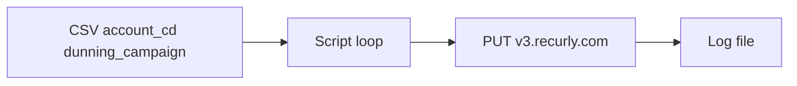

# Recurly bulk dunning campaign update script

## API behavior (from Recurly v3 / your confirmed choice)

- **Host (US):** `https://v3.recurly.com` — not the admin UI host [`cbscom-sand.recurly.com`](https://cbscom-sand.recurly.com/); the sandbox site is identified in the path and by the API key ([Ruby client source](https://raw.githubusercontent.com/recurly/recurly-client-ruby/v3-v2021-02-25/lib/recurly/client.rb) uses `API_HOSTS[:us] = "https://v3.recurly.com"`).
- **Operation:** [Update account](https://recurly.com/developers/api/v2021-02-25/index.html#operation/update_account) maps to `PUT` with path `/accounts/{account_id}`; the Ruby client builds `PUT /accounts/{account_id}` and scopes by site to `/sites/{site_id}/accounts/{account_id}` ([operations excerpt](https://recurly.github.io/recurly-client-ruby/Recurly/Client.html)).
- **Site id:** From your sandbox subdomain `cbscom-sand`, use friendly site id **`subdomain-cbscom-sand`** (same pattern as Recurly’s examples: `/sites/subdomain-mysite/accounts/code-benjamin` in [GETTING_STARTED](https://recurly.github.io/recurly-client-ruby/file.GETTING_STARTED.html)).
- **Account identifier:** For each CSV `account_cd`, use **`code-{account_cd}`** in the path (URL-encoded), e.g. `code-5020580060`.
- **Body:** JSON object for account update: `{"dunning_campaign_id": "<dunning_campaign column>"}` — map your CSV column `dunning_campaign` to the API field `dunning_campaign_id` (your sample values like `g_no_vind_test` are treated as the campaign id string).
- **Version / Accept:** Match library default for `v2021-02-25`: `Accept: application/vnd.recurly.v2021-02-25` (see `api_version` in Recurly Ruby `operations.rb`).
- **Auth:** Per Recurly’s note, HTTP Basic with **username = API key** and empty password: in Python, `requests.put(..., auth=(api_key.strip(), ""))` or `Authorization: Basic base64(api_key + ":")`.
- **Optional but aligned with official clients:** Send `Content-Type: application/json` and an `Idempotency-Key` header per request (UUID), as the Ruby client does for non-GET requests ([`set_headers`](https://raw.githubusercontent.com/recurly/recurly-client-ruby/v3-v2021-02-25/lib/recurly/client.rb)).

## Implementation plan

1. **Add a single script** under the repo, e.g. [`scripts/recurly_bulk_update_dunning.py`](scripts/recurly_bulk_update_dunning.py) (name can be adjusted; keep it self-contained — no dependency on other repo scripts per your note).
2. **Configuration (constants or `argparse`):**
   - API key: read first line (or whole file stripped) from [`/Users/gregory.hamilton/Desktop/Creds/recurly_us_sbx.txt`](file:///Users/gregory.hamilton/Desktop/Creds/recurly_us_sbx.txt) — do not print or log the key.
   - Input CSV: default [`/Users/gregory.hamilton/Downloads/g_sbx_dunning_test.csv`](file:///Users/gregory.hamilton/Downloads/g_sbx_dunning_test.csv); columns `account_cd`, `dunning_campaign` (header row).
   - Output log path: e.g. same directory as CSV with a fixed or timestamped filename, or CLI flag.
3. **HTTP client:** Use `urllib` (stdlib) or `requests` if you prefer; one `PUT` per row. Treat HTTP **2xx** as success; anything else as failure (optionally append short status code or Recurly error type from JSON body for debugging — avoid logging full responses if they might contain PII).
4. **Timestamps:** Use `zoneinfo.ZoneInfo("America/New_York")` and format **`YYYY-MM-DD HH:mm:ss`** (24-hour; if you need 12-hour with AM/PM, say so — your spec used `hh` which is ambiguous).
5. **Log format:** Append-only text or CSV lines, e.g. `account_cd,success|failure,timestamp_ny` — one line per input row, written after each request so a crash mid-run preserves prior rows.
6. **Robustness:** Skip empty rows; strip whitespace on fields; URL-encode path segments; optional small delay between calls if you hit rate limits (document or handle HTTP 429 with a simple retry if you want it in scope).

## Verification (after implementation)

- Dry-run: point at a 1-row CSV and confirm one log line and expected HTTP status.
- Confirm a successful response updates the account in the sandbox UI under the expected dunning campaign.

No changes to existing SQL or gateway scripts are required.
